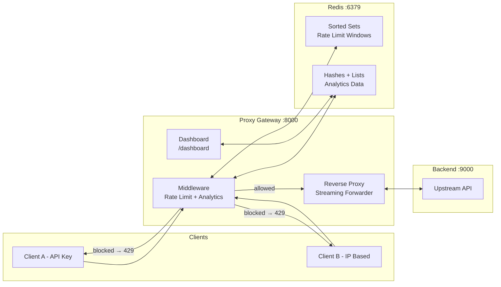

# ⚡ API Rate Limiter & Analytics Reverse Proxy

A lightweight **reverse proxy gateway** that sits in front of any API to protect it from traffic spikes and abuse. Built with FastAPI, Redis, and httpx.


---

## What It Does

When a client sends a request to `localhost:8000/api/v1/users`, the proxy:

1. **Identifies the client** — via `X-API-Key` header or IP address
2. **Checks the rate limit** — using the Sliding Window Log algorithm in Redis
3. **If allowed** → forwards the request to the real backend and streams the response back
4. **If blocked** → returns `429 Too Many Requests` with a `Retry-After` header
5. **Logs analytics** — records RPM, latency, status codes, and top consumers

```
Client ──→ [Proxy :8000] ──→ Rate Limit Check ──→ Forward to Backend ──→ Stream Response
                │                    │
                │                    └── 429 Too Many Requests (if over quota)
                └── Record analytics (viewable at /dashboard)
```

## Architecture



## Features

| Feature | Implementation | File |
|---------|---------------|------|
| **Sliding Window Log** rate limiting | Redis Sorted Sets + atomic Lua script | `src/rate_limiter.py` |
| **Streaming reverse proxy** | httpx `AsyncClient` with `request.stream()` | `src/proxy.py` |
| **Standard rate limit headers** | `X-RateLimit-Limit`, `Remaining`, `Reset`, `Retry-After` | `src/middleware.py` |
| **Real-time analytics dashboard** | Chart.js with auto-refresh | `static/dashboard.html` |
| **Per-client identification** | API key or IP-based quotas | `src/middleware.py` |
| **Hop-by-hop header sanitization** | RFC 9110 compliant | `src/proxy.py` |
| **Connection pooling** | Shared `httpx.AsyncClient` via lifespan | `src/main.py` |
| **Configurable via environment** | Pydantic Settings + `.env` | `src/config.py` |

## Prerequisites

- **Python 3.11+**
- **Redis 7+** (via Docker or local install)
- **Docker & Docker Compose** (optional, for Redis)

## Quick Start

### 1. Clone & Install

```bash
git clone https://github.com/pushkarreddyy/api-rate-limiter-proxy.git
cd api-rate-limiter-proxy

python -m venv venv
venv\Scripts\activate        # Windows
# source venv/bin/activate   # macOS/Linux

pip install -r requirements.txt
```

### 2. Start Redis

```bash
docker compose up -d
```

Or if Redis is already running locally on port 6379, skip this step.

### 3. Start the Mock Backend (Port 9000)

```bash
python -m mock_backend.server
```

### 4. Start the Proxy Gateway (Port 8000)

```bash
# In a new terminal
uvicorn src.main:app --port 8000 --reload
```

### 5. Open the Dashboard

Navigate to **http://localhost:8000/dashboard** in your browser.

## API Usage Examples

### Normal Proxied Request

```bash
curl -i http://localhost:8000/api/v1/users
```

```http
HTTP/1.1 200 OK
X-RateLimit-Limit: 100
X-RateLimit-Remaining: 99
X-RateLimit-Reset: 1694380860

{"users": [...], "count": 5}
```

### Rate Limited Response (after exceeding quota)

```bash
# Send 101 rapid requests
for /L %i in (1,1,105) do @curl -s -o NUL -w "Request %i: %%{http_code}\n" http://localhost:8000/api/v1/users
```

```http
HTTP/1.1 429 Too Many Requests
X-RateLimit-Limit: 100
X-RateLimit-Remaining: 0
X-RateLimit-Reset: 1694380920
Retry-After: 47

{"error": "rate_limit_exceeded", "message": "Too many requests. Try again in 47 seconds.", "retry_after": 47}
```

### Using an API Key (separate quota per key)

```bash
curl -H "X-API-Key: my-secret-key" http://localhost:8000/api/v1/users
```

### Streaming Endpoint

```bash
curl http://localhost:8000/api/v1/stream
```

### POST with JSON Body

```bash
curl -X POST http://localhost:8000/api/v1/users \
  -H "Content-Type: application/json" \
  -d '{"name": "New User", "email": "new@example.com"}'
```

## How the Rate Limiting Works

This project uses the **Sliding Window Log** algorithm — the most precise rate limiting approach:

```
Window = 60 seconds, Limit = 100 requests

1. ZREMRANGEBYSCORE → Remove timestamps older than 60s ago (slides the window)
2. ZCARD            → Count remaining entries (= requests in last 60s)
3. IF count < 100:
     ZADD           → Log this request's timestamp
     → Return 200 with X-RateLimit-Remaining: (99 - count)
   ELSE:
     ZRANGE 0 0     → Find oldest entry to calculate when a slot opens
     → Return 429 with Retry-After: (seconds until oldest entry expires)
```

All three steps run inside an **atomic Lua script** on the Redis server — zero race conditions even under high concurrency.

## Configuration

All settings are configurable via environment variables or the `.env` file:

| Variable | Default | Description |
|----------|---------|-------------|
| `REDIS_URL` | `redis://localhost:6379/0` | Redis connection string |
| `UPSTREAM_BASE_URL` | `http://localhost:9000` | Target backend URL |
| `RATE_LIMIT_MAX_REQUESTS` | `100` | Max requests per window |
| `RATE_LIMIT_WINDOW_SECONDS` | `60` | Sliding window size in seconds |
| `PROXY_TIMEOUT_SECONDS` | `30` | Upstream request timeout |
| `LOG_LEVEL` | `INFO` | Logging level |

## Project Structure

```
├── docker-compose.yml          # Redis service
├── requirements.txt            # Python dependencies
├── .env.example                # Environment variable template
├── src/
│   ├── main.py                 # FastAPI app entry point + lifespan
│   ├── config.py               # Pydantic Settings configuration
│   ├── rate_limiter.py         # Sliding Window Log (Redis + Lua script)
│   ├── proxy.py                # Reverse proxy with streaming support
│   ├── middleware.py           # Rate limit enforcement + analytics recording
│   ├── analytics.py            # Metrics recording & query service
│   └── dashboard.py            # Dashboard API routes
├── static/
│   └── dashboard.html          # Analytics dashboard (Chart.js)
├── mock_backend/
│   └── server.py               # Mock upstream API for testing
└── tests/
    └── __init__.py
```

## Tech Stack

| Layer | Technology | Why |
|-------|-----------|-----|
| Framework | FastAPI + Uvicorn | Async-native, streaming support, auto OpenAPI |
| HTTP Client | httpx AsyncClient | Async streaming for request & response bodies |
| Rate Limiter | Redis Sorted Sets + Lua | Atomic sliding window, one round-trip, zero races |
| Analytics | Redis (Hashes, Sorted Sets, Lists) | Lightweight time-series without extra databases |
| Dashboard | HTML + Chart.js (CDN) | Zero build step, single file |

## Author & Attribution

Created and maintained by **[Pushkar Reddy (@pushkarreddyy)](https://github.com/pushkarreddyy)**.

> [!IMPORTANT]
> **Attribution Requirement**: If you use, fork, adapt, or reference this project or its codebase in your own software, research, or articles, **explicit credit must be given to Pushkar Reddy (@pushkarreddyy)** along with a link back to this original repository:  
> `https://github.com/pushkarreddyy/api-rate-limiter-proxy`

## License

This project is licensed under the MIT License — see the [LICENSE](LICENSE) file for details. Attribution to the author (`pushkarreddyy`) must be retained in all copies or substantial portions of the software.
